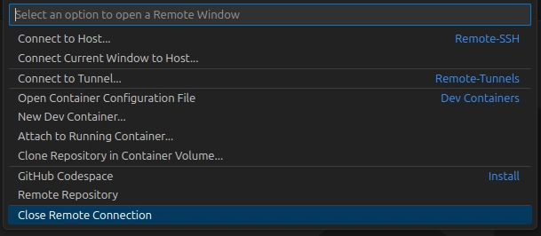

# Working with Google Cloud Shell

This guide outlines how to work with Google Cloud Shell, either using the built-in Web Editor or by connecting from your local Visual Studio Code. It is inspired by [this article](https://dev.to/olymahmud/connect-to-google-cloud-shell-from-visual-studio-code-461b).

## Option 1: Use the Web Editor (Recommended)

The easiest way to write code in Google Cloud Shell is to use the built-in Cloud Shell Editor, which is based on Theia (an open-source IDE similar to VS Code).

### Launching the Editor

**Direct Link:** Navigate directly to [ide.cloud.google.com](https://ide.cloud.google.com).
 - This opens a standalone version of the editor without the heavy Cloud Console UI around it.
### Features
*   **VS Code-like experience:** Familiar interface, keyboard shortcuts, and extensions.
*   **Pre-installed tools:** Comes with Go, Java, Node.js, Python, and Google Cloud SDK pre-installed.
*   **Persistent Disk:** Your `/home/username` directory is persistent (5GB storage).

---

## Option 2: Connect from Local VS Code (Manual Setup)

This method allows you to connect from your local VS Code on Windows (or other OS) without installing the Google Cloud SDK locally. You will generate SSH keys in the Cloud Shell and use them to connect.

### Prerequisites
1.  **VS Code** installed on your local machine.
2.  **Remote - SSH** extension installed in VS Code.
    *   *To verify:* Click the **Extensions** icon in the Sidebar (or press `Ctrl+Shift+X`), search for "Remote - SSH", and ensure it is listed as **Installed**.
3.  **Active Cloud Shell** (open in your browser via [ide.cloud.google.com](https://ide.cloud.google.com)).

### Step-by-Step Guide

#### 1. Get SSH Connection Details
Run the following command in the Cloud Shell terminal to get the full connection command:

```bash
gcloud cloud-shell ssh --dry-run
```

The output will look similar to this:
```bash
/usr/bin/ssh -i /home/username/.ssh/google_compute_engine -p 6000 username@35.123.45.67
```

From this output, identify and note down:
*   **Private Key Path:** (e.g., `/home/username/.ssh/google_compute_engine`)
*   **Username:** (e.g., `username`)
*   **Host IP:** (e.g., `35.123.45.67`)
*   **Port:** (e.g., `6000`)

#### 2. Download the Private Key to Windows
You need to download the private key identified in Step 1 to your Windows machine.

1.  In the Cloud Shell Editor's file explorer, navigate to the key path (usually `~/.ssh/`).
    *   **Tip:** If the `.ssh` folder is hidden, go to **File > Open Folder...** and type `/home/your-username/.ssh/` (replace `your-username` with your actual username).

    
    
    

    *   If you don't see the `.ssh` folder, you may need to type the path manually or use the terminal.
2.  Right-click the private key file (e.g., `google_compute_engine`) and select **Download**.
    
    

    *   *Alternative:* Run `dl <path_to_key>` in the terminal (e.g., `dl ~/.ssh/google_compute_engine`).
3.  Save the file to a secure location on Windows (e.g., `C:\Users\YourName\.ssh\google_compute_engine`).
    *   *Note:* The browser might save it as `google_compute_engine.txt`. This is fine, just remember the full name.

#### 3. Configure Local VS Code
1.  Open VS Code on Windows.
2.  Press `F1` and select **Remote-SSH: Open Configuration File...**.
3.  Choose your personal config file (usually `C:\Users\YourName\.ssh\config`).
4.  Add the following entry using the details from Step 1:

```ssh
Host google-cloud-shell
    HostName <EXTERNAL_IP_FROM_STEP_3>
    User <USERNAME_FROM_STEP_3>
    Port 6000
    IdentityFile C:\Users\YourName\.ssh\google_compute_engine.txt
    StrictHostKeyChecking no
```
*Make sure `IdentityFile` points to the exact file you saved (including `.txt` if present).*

#### 5. Connect
1.  Click the **Remote Explorer** icon in the sidebar.
    
    

2.  Select **SSH Targets**.
3.  Find `google-cloud-shell` in the list.

    

4.  Click the **Connect** (âž”) button.

    

### Alternative: Manual Connection via UI
If you prefer not to edit the config file manually:
1.  Hover over **SSH Targets** and click the ‘+’ icon.
2.  Enter the connection command (e.g., `ssh user@IP`):
    
    

### Disconnecting
To disconnect, click the remote indicator area (bottom-left) and select **Close Remote Connection**.




